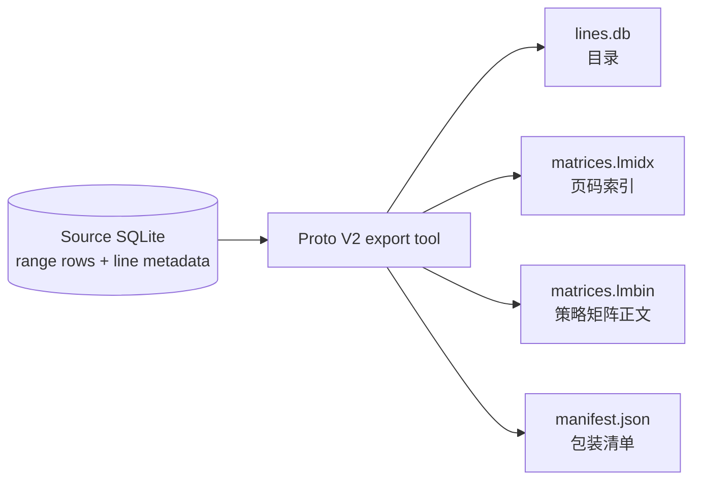
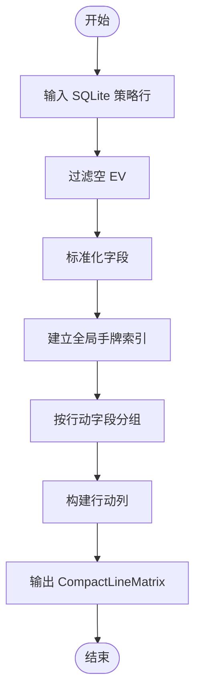
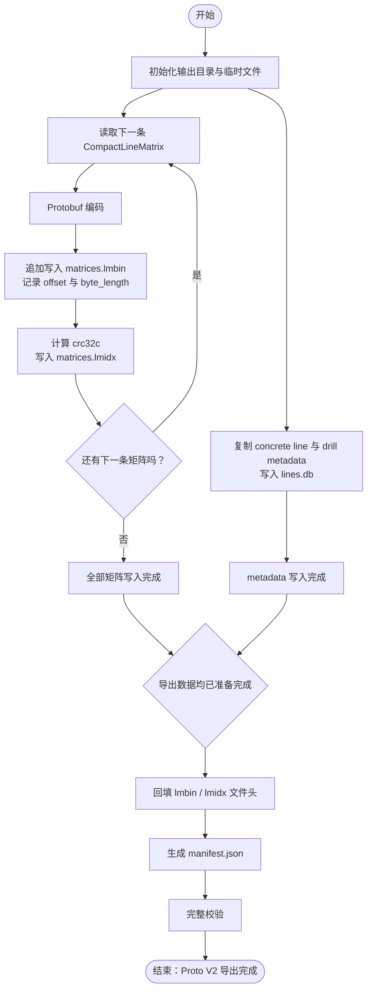
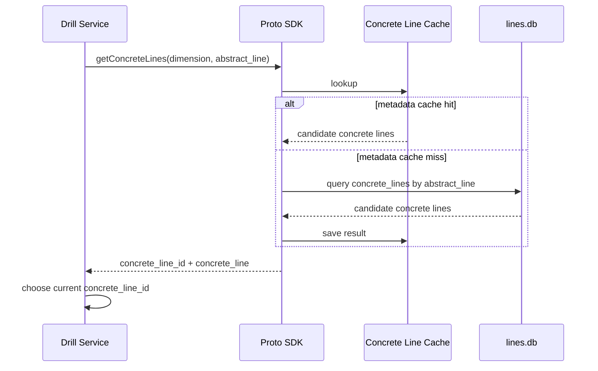
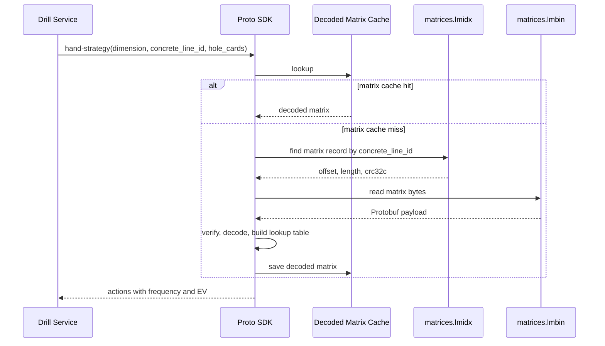

# Proto V2 存储方案汇报

## 结论

**Proto V2 将一条行动线的完整策略打成一个矩阵数据包。**

1. 九个维度的 Proto V2 策略矩阵文件合计 **113.60 MiB**；同一批非 NULL EV 策略行的 SQLite range tables 合计 **1,076.55 MiB**，Proto V2 为 SQLite 的 **10.55%**。
2. V2 只替换策略矩阵 payload；行动线、drill 等需要筛选的目录信息继续由 SQLite 保存。
3. 业务接口继续使用 `dimension + concrete_line_id` 查询，不需要了解 `lmidx`、`lmbin` 或 Protobuf 字段。

性能与内存基线正在按真实 replay 重建，当前不展示 Proto 与 SQLite 的速度或 RSS 比较。

---

## 先建立一个心智模型

导出工具把一套 SQLite 策略数据，整理成一个“可查询的数据包”。

| 数据包组成 | 新手解释                            | 实际文件         |
| ---------- | ----------------------------------- | ---------------- |
| 目录       | 有哪些行动线、drill 信息            | `lines.db`       |
| 页码索引   | 第 N 条行动线的策略矩阵在正文的哪里 | `matrices.lmidx` |
| 正文       | 每条行动线真正的策略矩阵            | `matrices.lmbin` |
| 包装清单   | 版本、维度、文件名和完整性信息      | `manifest.json`  |

核心想法：**每条行动线的完整策略先打成一个矩阵数据包，正文写入 `lmbin`，再通过 `lmidx` 快速找到它。**

---

## 四个核心概念

| 概念                   | 通俗解释                                    | 示例                              |
| ---------------------- | ------------------------------------------- | --------------------------------- |
| 维度 `dimension`       | 一套独立策略数据的范围                      | `default:6max:100BB`              |
| 行动线 `concrete line` | 一条确定的历史行动路径                      | `F-F-R2`                          |
| 策略矩阵 `LineMatrix`  | 该行动线下，各种手牌对应每个动作的频率和 EV；实现中使用 Protobuf 的 `CompactLineMatrix` 类型 | `AKs` 在 raise/call/fold 下的策略 |
| 索引                   | 根据行动线 ID 找到该矩阵在数据文件中的位置  | `concrete_line_id -> offset`      |

`abstract_line` 只在 drill / metadata 查询中使用：它是一个分类条件，可能对应多条具体行动线；真正读取策略矩阵时使用 `concrete_line_id`。

---

## 原问题

SQLite 的原始策略表按“行动线 × 手牌 × 动作”存储。对同一行动线来说，行动定义和上下文会在大量行中重复出现。

```text
原始读取：多行 SQLite records
目标读取：一条行动线 -> 一个完整    CompactLineMatrix
```

SQLite 仍负责目录、drill 和筛选；Proto V2 只改变矩阵正文的存储方式。

---

## 图一：源数据经过导出后生成什么

这张图只回答：**源 SQLite 经过导出工具后生成哪些文件。**



---

## 图二：单条行动线如何变成矩阵

这张图只回答：**同一条具体行动线的多行 SQLite 策略数据，如何转成按动作分列的一条 `CompactLineMatrix`。**

**行转列的最小例子：**SQLite 中每一行表示“某个手牌对某个动作的策略”。例如，同一条具体行动线有 `AA -> fold`、`AA -> raise`、`KK -> fold` 三行；转换后会形成两列：`fold` 列保存 `AA` 与 `KK` 的频率和 EV，`raise` 列只保存 `AA` 的频率和 EV。同一手牌的数据会因动作不同而进入不同的行动列。



| 流程节点         | 解释                                                |
| ---------------- | --------------------------------------------------- |
| 过滤空 EV        | 去掉没有有效策略结果的行。                          |
| 标准化字段       | 把手牌、动作、频率和 EV 转换成统一格式。            |
| 建立全局手牌索引 | 记录当前行动线实际包含哪些手牌。                    |
| 按行动字段分组   | 把相同 raise、call、fold 等动作的手牌数据归在一起。 |
| 构建行动列       | 每个动作只保存自己覆盖的手牌、频率和 EV。           |

对每条具体行动线重复图二的过程，就得到一批 `CompactLineMatrix`；图三说明这批矩阵如何依次写入同一个 dimension 的文件。

---

## 图三：矩阵如何写入文件

这张图只回答：**已经构建好的矩阵，如何循环写入一个 dimension 的文件。**



---

## 业务查询时序

### `abstract_line -> concrete_line`

一个 `abstract_line` 可对应多条 `concrete_line`。SDK 返回候选行，Drill Service 根据当前业务分支选择具体的 `concrete_line_id`。



### `hand-strategy`



`hand-by-actions` 复用相同的矩阵读取过程；差异只在矩阵读取后，按动作和频率条件筛选并返回符合条件的手牌。

---

## 九维存储结果

| dimension  |  filtered SQLite |        `lmbin` |      `lmidx` |     V2 archive | V2 / SQLite |
| ---------- | ---------------: | -------------: | -----------: | -------------: | ----------: |
| 6max:100BB |     7,352.00 KiB |     733.75 KiB |    58.41 KiB |     792.15 KiB |      10.77% |
| 6max:200BB |     5,484.00 KiB |     528.88 KiB |    36.94 KiB |     565.82 KiB |      10.32% |
| 6max:300BB |     4,660.00 KiB |     434.34 KiB |    28.39 KiB |     462.73 KiB |       9.93% |
| 8max:100BB |    15,616.00 KiB |   1,629.34 KiB |   138.95 KiB |   1,768.29 KiB |      11.32% |
| 8max:200BB |    11,696.00 KiB |   1,152.67 KiB |    85.23 KiB |   1,237.90 KiB |      10.58% |
| 8max:300BB |     9,796.00 KiB |     905.34 KiB |    56.94 KiB |     962.28 KiB |       9.82% |
| 9max:100BB |   352,436.00 KiB |  35,320.85 KiB | 3,079.50 KiB |  38,400.35 KiB |      10.90% |
| 9max:200BB |   447,168.00 KiB |  43,970.61 KiB | 3,172.33 KiB |  47,142.94 KiB |      10.54% |
| 9max:300BB |   248,180.00 KiB |  23,511.10 KiB | 1,486.17 KiB |  24,997.28 KiB |      10.07% |
| **合计**   | **1,076.55 MiB** | **105.65 MiB** | **7.95 MiB** | **113.60 MiB** |  **10.55%** |

口径：只比较策略 range 数据；两边都使用 `hand_ev IS NOT NULL` 的同一行集，不混入 drill、concrete line 或服务文件。

---

## 实现细节

<details>
<summary><strong>查看 lmidx / lmbin 的二进制布局</strong></summary>

### 文件职责

| 文件             | 内容                                             | 读取职责                                          |
| ---------------- | ------------------------------------------------ | ------------------------------------------------- |
| `matrices.lmidx` | 16-byte header + 每条 matrix 固定 16-byte record | 由 `concrete_line_id` O(1) 定位 payload           |
| `matrices.lmbin` | 16-byte header + 连续拼接的 raw Protobuf payload | 按 offset / length 读取 `CompactLineMatrix` bytes |

### 文件头（两文件均为 little-endian、16 bytes）

| 字节范围 | 字段           | `lmidx`    | `lmbin`    |
| -------- | -------------- | ---------- | ---------- |
| `0..3`   | `magic`        | `LMCX`     | `LMCN`     |
| `4..5`   | `version`      | `u16 = 2`  | `u16 = 2`  |
| `6..7`   | `header_size`  | `u16 = 16` | `u16 = 16` |
| `8..15`  | `record_count` | `u64`      | `u64`      |

### `lmidx` 索引记录（header 后固定 16 bytes）

| 字节范围 | 字段          | 类型  | 含义                                                   |
| -------- | ------------- | ----- | ------------------------------------------------------ |
| `0..7`   | `offset`      | `u64` | payload 在 `lmbin` 中的绝对字节偏移；第一条为 `16`     |
| `8..11`  | `byte_length` | `u32` | 该条 raw Protobuf payload 的长度；`lmbin` 不重复写长度 |
| `12..15` | `crc32c`      | `u32` | 按配置的单条读取校验；完整验证始终校验                 |

| `concrete_line_id` 规则     | 公式                     |
| --------------------------- | ------------------------ |
| 连续编号                    | 从 `1` 到 `record_count` |
| 第 `N` 条 index record 位置 | `16 + (N - 1) * 16`      |

</details>

<details>
<summary><strong>查看完整 compact_matrix.proto</strong></summary>

以下 schema 与 [`compact_matrix.proto`](../../storage-tools/proto/zenithstrat/gto/v2/compact_matrix.proto) 保持一致。

```proto
syntax = "proto3";

package zenithstrat.gto.v2;

enum ActionType {
  ACTION_TYPE_UNSPECIFIED = 0;
  ACTION_TYPE_FOLD = 1;
  ACTION_TYPE_CHECK = 2;
  ACTION_TYPE_CALL = 3;
  ACTION_TYPE_BET = 4;
  ACTION_TYPE_RAISE = 5;
  ACTION_TYPE_ALLIN = 6;
}

enum HandEncoding {
  HAND_ENCODING_UNSPECIFIED = 0;
  HAND_ENCODING_169 = 1;
  HAND_ENCODING_1326_COMBO = 2;
}

message CompactActionColumn {
  ActionType action_type = 1;

  // Action 后该玩家在本轮的总投入额，单位：1 / 100 BB。
  uint32 amount_centi_bb = 2;

  // 行动尺寸，单位：1 / 10000。
  uint32 action_size_x10000 = 3;

  // 只保存 action_hand_bitmap 中置位手牌的数据。
  // 数组第 i 项对应 action_hand_bitmap 中第 i 个置位的
  // global_compact_index，按 global_compact_index 升序。
  // 长度必须等于 popcount(action_hand_bitmap)。
  repeated uint32 frequency_x10000 = 4 [packed = true];

  // 与 frequency_x10000 一一对应，长度必须相同。
  repeated sint32 ev_x10000 = 5 [packed = true];

  // 当前 action 实际覆盖的手牌，位图域为 global_compact_index。
  // 长度必须等于 ceil(popcount(CompactLineMatrix.valid_hand_bitmap) / 8)。
  // byte_index = global_compact_index >> 3，bit_index = global_compact_index & 7。
  // 每个 byte 内低位优先（LSB-first）。
  bytes action_hand_bitmap = 6;
}

message CompactLineMatrix {
  // 固定为 2，表示此紧凑编码规范。
  uint32 schema_version = 1;

  HandEncoding hand_encoding = 2;

  repeated CompactActionColumn actions = 3;

  // 原始 hand_id 空间中当前行动线实际导出的手牌。
  // hand_ev IS NULL 的 SQLite 行不会导出。
  // bit 的 rank 定义 original hand_id -> global_compact_index 映射。
  // byte_index = hand_id >> 3，bit_index = hand_id & 7，LSB-first。
  bytes valid_hand_bitmap = 100;
}
```

</details>

收束结论：**V2 已完成格式、导出、校验和存储体积验证。性能与内存只在一致 replay 基线重建完成后再做结论。**
