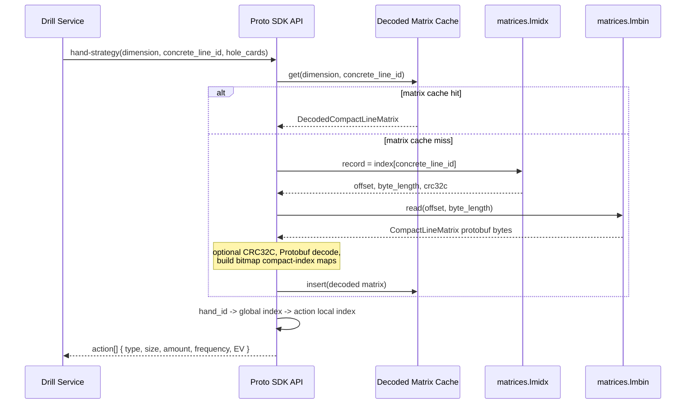
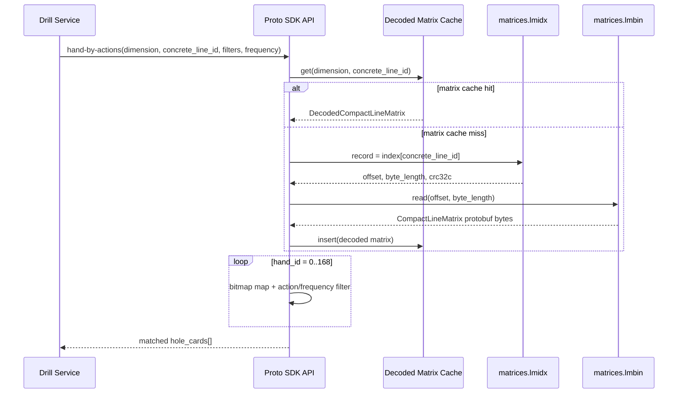
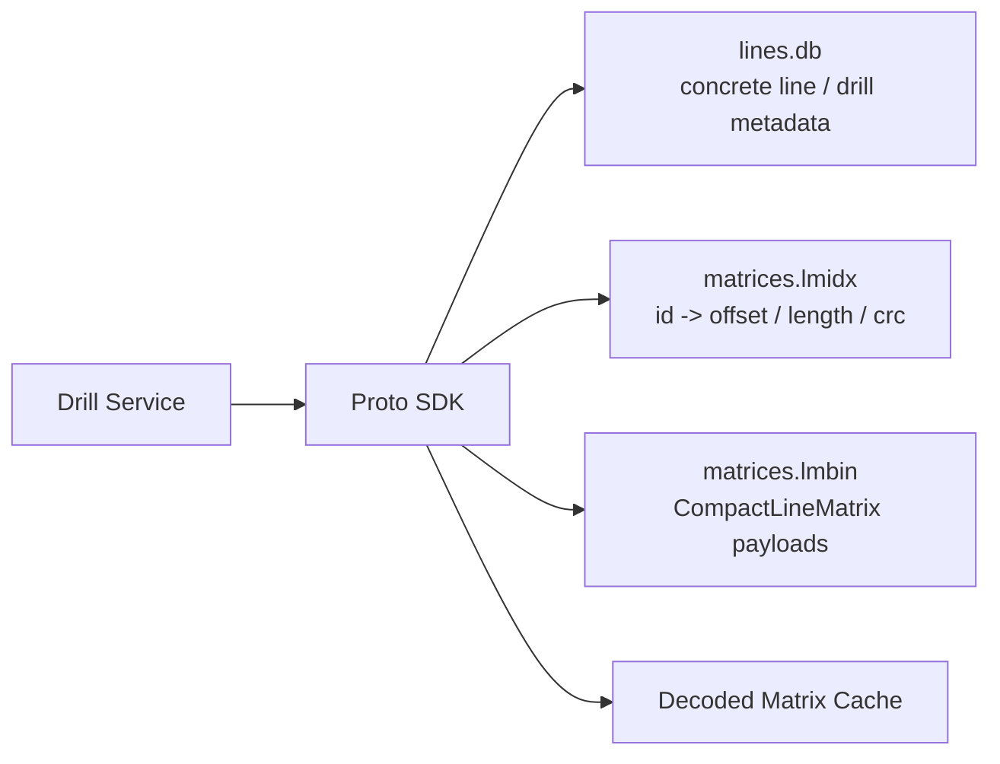
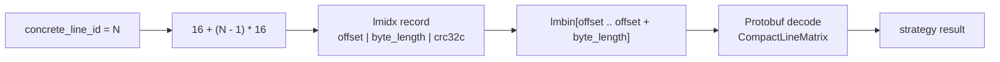
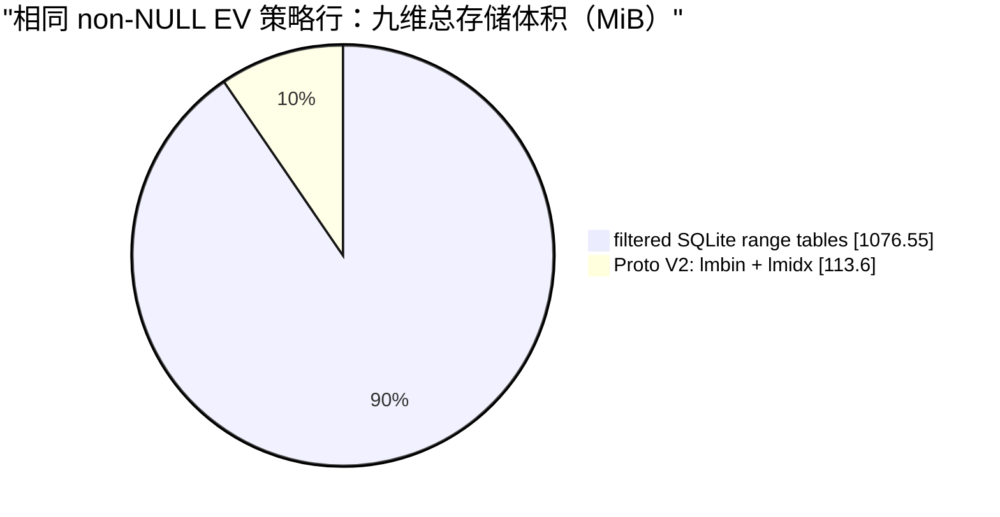

# Proto V2 存储方案汇报稿

> 用途：面向产品、业务和研发负责人说明 Proto V2 的目标、边界、收益和后续工作。
> 主报告建议控制在 9 页，技术格式细节和完整 benchmark 表放附录。

## 汇报原则

- 先说明业务问题和结果，再解释 Protobuf、bitmap 与索引细节。
- 存储对比统一排除 `hand_ev IS NULL`，因为 V2 不导出这类 cell。
- 不把 V2 描述成“用 Protobuf 替换所有 SQLite”。它是策略矩阵存储方案；筛选型 metadata 仍由 SQLite 承担。
- 性能与内存结论必须建立在可比较的 canonical replay 基线之上。

---

## 第 1 页：结论先行

**标题：Proto V2 将策略矩阵改为按行动线聚合存储，体积更小，查询接口保持不变。**

建议口述：

> 我们没有把整个系统改成 Protobuf。我们只将最密集、最重复的策略矩阵改为按行动线聚合的 Protobuf 文件；行动线、drill 等需要筛选的 metadata 继续使用 SQLite。这样既减少了策略数据的冗余，又不牺牲现有查询能力。

展示三条结论：

1. 全部九个维度合计，Proto V2 matrix core archive 为 **113.60 MiB**；语义等价的 filtered SQLite range tables 为 **1,076.55 MiB**，减少 **89.45%**。
2. Proto / SQLite 性能与内存基线正在重建；旧三方 benchmark 因结果校验、预热和缓存口径不一致已撤回，不展示速度或 RSS 优势结论。
3. V2 保留现有 Core-compatible 查询接口，业务端继续以 canonical `concrete_line_id` 调用，不需要了解 `.lmidx` 或 `.lmbin`。

图表建议：三张小卡片，分别为“九维体积 -89.45%”“性能基线重建中”“接口兼容”。

---

## 第 2 页：原问题是什么

**标题：SQLite 行式存储适合关系查询，但策略矩阵存在大量重复结构。**

建议口述：

> 一条策略数据在 SQLite 中会被拆成大量“行动线 × 手牌 × action”的行。查询灵活，但 action 定义、行动线和手牌上下文重复出现。我们的热点查询通常不是任意 SQL 分析，而是给定行动线和手牌后直接取策略矩阵中的少量值。

页面内容：

```text
原始逻辑单位：concrete line × hand × action = 多行 SQLite records
实际读取单位：一条 concrete line 的策略矩阵 = 一个完整的 LineMatrix
```

强调：SQLite 仍保留给 drill、concrete line、筛选和 metadata；V2 只改变矩阵 payload 的承载方式。

---

## 第 3 页：方案总览

**标题：每个维度由 metadata SQLite、定位索引和 Protobuf matrix 文件组成。**

```text
Proto V2 dimension directory
├── lines.db        concrete line 与 drill metadata
├── matrices.lmidx  concrete_line_id -> offset / length / crc32c
├── matrices.lmbin  按 concrete line 连续写入的 Protobuf LineMatrix
└── manifest.json   版本、维度、文件与完整性声明
```

建议口述：

> `lines.db` 解决“查哪条线”的问题；`lmidx` 解决“数据在文件哪里”的问题；`lmbin` 保存“这条线的策略矩阵”。三者职责明确，读取大矩阵时不需要扫描 SQLite 行。

补充说明：`lmidx` 每条索引固定为 `offset + byte_length + crc32c`，即 `u64 + u32 + u32`，共 16 bytes。

---

## 第 4 页：`lmidx` 与 `lmbin` 的文件结构

**标题：索引文件负责定位，数据文件负责承载矩阵；两者都不承担业务 metadata 查询。**

| 文件 | 内容 | 读取职责 |
| --- | --- | --- |
| `matrices.lmidx` | 16-byte header + 每条 matrix 固定 16-byte record | 由 `concrete_line_id` O(1) 定位 payload |
| `matrices.lmbin` | 16-byte header + 连续拼接的 raw Protobuf payload | 按 offset / length 读取 `CompactLineMatrix` bytes |

两个文件均使用 little-endian 16-byte header：

```text
bytes 0..3   magic       lmbin = "LMCN"；lmidx = "LMCX"
bytes 4..5   u16 version = 2
bytes 6..7   u16 header_size = 16
bytes 8..15  u64 record_count
```

`lmidx` header 后每条记录固定为：

```text
u64 offset
u32 byte_length
u32 crc32c
```

- `offset` 是 payload 在 `lmbin` 中的绝对字节偏移，第一条从 `16` 开始。
- `byte_length` 是该条 raw Protobuf payload 的长度；`lmbin` 内不再额外重复写长度。
- `crc32c` 用于按配置的单条读取校验；完整验证始终校验。
- `concrete_line_id` 从 1 连续编号，索引位置固定为 `16 + (id - 1) * 16`。

`lmbin` header 后的布局：

```text
[header][LineMatrix #1 protobuf bytes][LineMatrix #2 protobuf bytes] ...
          ^ offset / byte_length 由 lmidx 唯一给出
```

建议口述：

> `lmidx` 本身不保存 frequency、EV 或行动定义，它只告诉 SDK “第 N 条矩阵从哪里读、读多少字节、如何校验”。`lmbin` 则只保存连续的 Protobuf 矩阵。这个分离使我们无需扫描大文件或执行 SQLite 行查询，就能直接跳到目标矩阵。

读取步骤：

```text
concrete_line_id -> lmidx record -> offset / length -> lmbin byte range
                 -> CRC32C（按配置）-> Protobuf decode -> strategy result
```

---

## 第 4 页后：`CompactLineMatrix` 的 Protobuf 结构

矩阵 payload 是一个 `CompactLineMatrix`。完整字段注释以
[`compact_matrix.proto`](../../storage-tools/proto/zenithstrat/gto/v2/compact_matrix.proto) 为准。

```proto
message CompactLineMatrix {
  uint32 schema_version = 1;       // 固定为 2
  HandEncoding hand_encoding = 2; // 当前为 169 手编码
  repeated CompactActionColumn actions = 3;
  bytes valid_hand_bitmap = 100;  // original hand_id 域
}

message CompactActionColumn {
  ActionType action_type = 1;
  uint32 amount_centi_bb = 2;
  uint32 action_size_x10000 = 3;
  repeated uint32 frequency_x10000 = 4 [packed = true];
  repeated sint32 ev_x10000 = 5 [packed = true];
  bytes action_hand_bitmap = 6;   // global_compact_index 域
}
```

读取关系：`valid_hand_bitmap` 将原始 `hand_id` 映射为 global compact index；每个 action 的
`action_hand_bitmap` 再将 global compact index 映射为该 action 的 `frequency` / `EV` 数组下标。
`frequency` 与 `EV` 只保存 action bitmap 置位的手牌，数组不能按原始 hand_id 直接索引。

---

## 第 5 页：真实业务策略调用时序

**标题：策略 API 接收业务已确定的 canonical line；matrix 查询不经过 metadata SQLite。**

实体规划：

- **Drill Service**：维护业务行动流程，提供 canonical `concrete_line_id`、维度、手牌或 action filter。
- **Proto SDK API**：提供 `hand-strategy` 与 `hand-by-actions`；负责 hand 编码、缓存和结果组装。
- **Decoded Matrix Cache**：按 `dimension + concrete_line_id` 缓存已解码矩阵。
- **`matrices.lmidx` / `matrices.lmbin`**：仅在 matrix cache miss 时定位、读取和 decode payload。
- **`lines.db`**：只用于 `concrete-lines-exact` 与 `drill-scenarios-metadata`；下列两条策略 API 在已有 canonical id 时不访问它。

### `hand-strategy`



### `hand-by-actions`



必须明确：业务端负责把行动过程转换为 canonical concrete line；Proto SDK 不推断默认弃牌、多人底池顺序或业务行动语义。

---

## 第 6 页：一条矩阵是怎样压紧的

**标题：不存无 EV cell；仅对真实存在的 hand/action 数据编码。**

建议用下图替代字段表：

```text
LineMatrix
├── actions
│   ├── action identity: type + size + amount
│   ├── action_hand_bitmap
│   ├── frequency[]
│   └── ev[]
└── valid_hand_bitmap
```

通俗解释：

- `hand_ev = NULL` 的 SQLite 行不导出；真实 EV 为 0 的值仍正常保存。
- `valid_hand_bitmap` 表示这一行动线实际包含哪些手牌。
- 每个 action 再用自己的 bitmap 表示哪些手牌拥有该 action 的 frequency / EV。
- frequency 与 EV 使用定点整数保存，避免浮点文本/行存储开销。

讲解边界：这页只说“bitmap 将手牌映射到紧凑数组”；`original hand_id -> global compact index -> action compact index` 的完整规则移到附录。

---

## 第 7 页：九维存储结果

**标题：九个维度在统一 NULL EV 过滤口径下，Proto V2 matrix archive 约为 SQLite 的一成。**

| dimension | filtered SQLite | `lmbin` | `lmidx` | V2 archive | V2 / SQLite |
| --- | ---: | ---: | ---: | ---: | ---: |
| 6max:100BB | 7,352.00 KiB | 733.75 KiB | 58.41 KiB | 792.15 KiB | 10.77% |
| 6max:200BB | 5,484.00 KiB | 528.88 KiB | 36.94 KiB | 565.82 KiB | 10.32% |
| 6max:300BB | 4,660.00 KiB | 434.34 KiB | 28.39 KiB | 462.73 KiB | 9.93% |
| 8max:100BB | 15,616.00 KiB | 1,629.34 KiB | 138.95 KiB | 1,768.29 KiB | 11.32% |
| 8max:200BB | 11,696.00 KiB | 1,152.67 KiB | 85.23 KiB | 1,237.90 KiB | 10.58% |
| 8max:300BB | 9,796.00 KiB | 905.34 KiB | 56.94 KiB | 962.28 KiB | 9.82% |
| 9max:100BB | 352,436.00 KiB | 35,320.85 KiB | 3,079.50 KiB | 38,400.35 KiB | 10.90% |
| 9max:200BB | 447,168.00 KiB | 43,970.61 KiB | 3,172.33 KiB | 47,142.94 KiB | 10.54% |
| 9max:300BB | 248,180.00 KiB | 23,511.10 KiB | 1,486.17 KiB | 24,997.28 KiB | 10.07% |
| **合计** | **1,076.55 MiB** | **105.65 MiB** | **7.95 MiB** | **113.60 MiB** | **10.55%** |

建议口述：

> 这个对比只统计策略 range 数据，不把 drill、concrete lines 或服务文件混进 SQLite 基线。九维共保留 18,956,044 条非 NULL EV 策略行。Proto V2 的核心收益来自两点：不再导出 NULL EV cell，以及按行动线聚合并使用紧凑数组和位图。

备注：6max:100BB 的旧 binary `.bin + .idx` 为约 2,201.60 KiB；Proto V2 archive 为 792.15 KiB。该结果同时受 V2 的 NULL EV 过滤影响，因此汇报时应将“语义等价的 filtered SQLite”作为主基线，而不是把不同过滤口径的格式比较作为唯一结论。

---

## 第 8 页：性能基线状态

**标题：旧性能结论已撤回，重新建立可比基线后再展示图表。**

旧三方 benchmark 不再用于汇报，原因如下：

- 只校验了 result count，未校验 action、size、amount、frequency、EV 的完整返回值；
- Proto 可保留 decoded matrix，SQLite 路径逐请求 prepare SQL，未明确为同一 cache profile；
- memory worker 对 SQLite 预热了 hand/batch/actions，而 Core / Proto 只预热 metadata，RSS 不能横向比较；
- process-cold 与 hot 的生命周期、缓存状态没有以同一 replay 统一定义。

新的正式基线必须使用 canonical replay、全量结果校验、`sqlite-direct-prepared`、
`sqlite-matrix-lru`、`proto-cache-off` 与 `proto-matrix-lru` 四个 profile。具体设计见
[`replay-memory-benchmark-design.md`](replay-memory-benchmark-design.md)。

建议口述：

> 目前我们只保留可严格证明的存储体积和格式正确性结论。性能数据必须让 Proto 与 SQLite 承担相同业务结果、相同 replay 和可解释的缓存成本；旧数字已删除，重测后再进入汇报。

---

## 第 9 页：冷启动与内存基线

**标题：冷启动与 RSS 需要在同一 replay 和同一 cache profile 下重测。**

正式测量将分别记录 `process start`、`reader open`、`warmup complete`、`timed replay complete`
四个阶段的 RSS，并区分应用层 cache bytes 与 OS working set。每个 profile 使用 fresh process 重复
10-20 次，只将 P50/P95 作为结论。

不再展示旧的首次查询时间或 RSS 数字。它们的预热内容不对等，不能说明 Proto 与 SQLite 的内存成本差异。

---

收束结论：**V2 已完成格式、导出、校验和存储体积验证。性能与内存只在一致 replay 基线重建完成后再做结论。**

---

## 附录 A：汇报图

### 图 A1：单维度文件与职责



### 图 A2：`lmidx` 定位 `lmbin` payload



### 图 A3：九维策略矩阵存储体积



图 A3 只比较策略 range payload：不含 drill、concrete line 或服务文件；两侧均使用
`hand_ev IS NOT NULL` 的相同行集。

## 附录 B：口径与风险

- 九维存储表按各源 range table 的原始 schema 单独复制 `hand_ev IS NOT NULL` 行并 `VACUUM` 后测得；每个基线保留表自身的 `AUTOINCREMENT` 与唯一索引。九维合计为 1,076.55 MiB SQLite 与 113.60 MiB Proto V2 archive。
- 旧三方性能、冷启动和 RSS 报告已删除，不可作为格式收益证据。未来结果必须遵循 [`replay-memory-benchmark-design.md`](replay-memory-benchmark-design.md) 的 profile、校验和采样口径。
- `hand_ev = NULL` 不在 V2 matrix 内；任何对比都必须过滤同一行集。
- `lines.db` 仍是 SQLite，因此 V2 的价值是矩阵 payload 路径，而不是消除所有 SQLite 文件。
- canonical concrete line 的业务语义由 Drill Service / 业务端维护；storage 不应在 reader 中补全或猜测行动。
